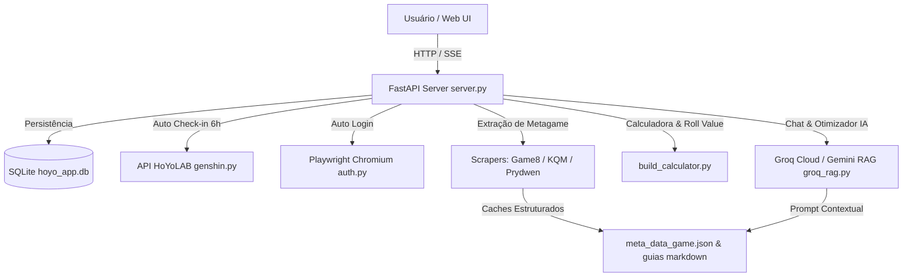

# 🤖 Cabeça de Droid (HoYo AI Assistant & Local RAG v3.0)

Uma ferramenta local moderna com interface gráfica **Web Premium** desenvolvida em **HTML5, CSS3 (Vanilla), JavaScript ES6+** e backend em Python (**FastAPI + SQLite**). 

> [!NOTE]
> **Sobre o nome:** "Cabeça de Droid" é uma referência divertida a *Honkai: Star Rail* — especificamente à maneira carinhosa como a Herta chama o **Aeon Nous** (o Aeon da Erudição), um supercomputador astral gigante que ascendeu à divindade após desenvolver uma Inteligência Artificial Geral (ASI).

O assistente sincroniza rosters de personagens, relíquias/artefatos/discos e recordes de Endgames via API do HoYoLAB, coleta guias analíticos de builds, tier lists e estatísticas do metagame (**KeqingMains**, **Prydwen**, **Game8**), realiza cálculo matemático de Roll Value (RV), otimização de builds com IA, cálculo de materiais de ascensão, monitoramento de energia em tempo real (Daily Notes) e **Auto-Check-in Diário** em segundo plano.

---

## 🌟 Principais Recursos e Interface (UI/UX)

- **📊 Mini-Dashboards da Conta:** Exibição em tempo real de estatísticas do jogador (UID, Nível da Conta, Total de Personagens e Personagens 5★/Rank S) no topo da tela de cada jogo.
- **🔋 Monitoramento Preciso de Energia (Daily Notes):** Acompanhamento em tempo real da Bateria (ZZZ), Resina (Genshin) e Poder de Desbravamento (HSR), com cronômetro de recuperação completa em tempo real e expedições ativas.
- **🎁 Auto-Check-in Diário Automático:** Resgate automático das recompensas diárias do HoYoLAB em segundo plano a cada 6 horas (com disparo inicial automático no arranque do servidor) e botão manual na interface com histórico de logs gravados no banco SQLite.
- **📁 Interface Web Premium (Glassmorphism):** Painel escuro moderno com esquemas de cores específicos por jogo (ZZZ, Genshin, HSR), efeitos de vidro fosco, transições fluidas e layout responsivo.
- **🎨 Visual com Ícones Dinâmicos (Font Awesome & Element Badges):** Ícones nativos de elementos de combate baixados em cache local e integrados à galeria.
- **⚡ Terminal de Logs em Tempo Real & Barra de Progresso:** Monitoramento visual do progresso de raspagem (0 a 100%) e logs retráteis linha a linha para cada sincronização.
- **🗡️ Inspetor de Builds & Sistema de Notas RV (SSS a D):**
  - Avaliação individual de cada peça via **Roll Value (RV)** com compensação de Main Stat (*Main Stat Forgiveness*) e peso parcial para atributos Flat.
  - Classificação de builds em **SSS** ($\ge 90\%$), **SS** ($\ge 75\%$), **S** ($\ge 60\%$), **A** ($\ge 45\%$), **B** ($\ge 30\%$) e **C/D** ($<30\%$).
- **⚖️ Comparador Meta Lado a Lado (Sidebar):** Aba exclusiva no inspetor que contrasta a arma equipada, conjuntos de relíquias e status principais do jogador diretamente contra os benchmarks do metagame, destacando acertos (verde) e desvios (vermelho).
- **🧠 Otimizador de Build IA:** Botão "Analisar" no painel do personagem que aciona a IA para gerar 3 conselhos diretos e acionáveis de melhorias de build.
- **📈 Calculadora de Materiais de Ascensão:** Estima em tempo real o custo total de Livros de XP, Mora/Créditos/Dennys e materiais de chefes necessários para evoluir um personagem do nível atual até o nível alvo (ex: 1 ao 90).
- **👥 Analisador de Sinergia de Times:** Seleção interativa de 4 personagens para gerar um relatório completo de rotação de combate, ressonância elemental, otimização de armas e sugestões de trocas via streaming SSE.
- **🌐 Dicionário de Tradução Inteligente Local (`traducoes.json`):** Traduz instantaneamente armas, artefatos, discos e atributos de Inglês para Português (PT-BR).
- **🎭 Suporte a Skins/Costumes (Enka.Network):** Mapeamento automático de IDs de roupas cosméticas de Genshin Impact para avatares de rosto do Enka.Network, evitando distorções visuais na galeria.
- **🤖 Assistente de Chat IA Meta (Groq RAG / Gemini):** Chat interativo alimentado por RAG local (Llama 3.3 70B ou Gemini) que lê o Roster ativo (nível 70+) e guias de meta locais.
- **🔑 Login Automático HoYoLAB (Playwright):** Disparo de janela isolada Chromium que captura os cookies de sessão (`ltuid_v2`, `ltoken_v2`) automaticamente.

---

## ⚙️ Arquitetura e Funcionamento do Sistema



### 1. Motor Mestre de IDs Universais e Resolução por Character ID
- O sistema opera prioritariamente com **Character IDs numéricos oficiais** (ex: `"1310"` para Firefly, `"10000070"` para Nilou) através da função `fetch_master_id_list`.
- **Normalização de Apelidos (`normalize_char_name`):** Trata variações de escrita, pontuação e codinomes (ex: *"Tingyun • Fugue"* $\rightarrow$ ID `"1225"`, *"Himeko - Nova"* $\rightarrow$ ID `"1510"`), garantindo cruzamento perfeito entre guias em inglês e dados da conta do jogador.

### 2. Banco de Dados SQLite (`hoyo_app.db`)
- Tabelas relacionais para contas (`game_accounts`), personagens (`characters`), relíquias (`character_relics`), notas diárias (`daily_notes_cache`) e logs de check-in (`daily_checkin_logs`).
- Fornece carregamento instantâneo da interface sem dependência contínua de requisições de rede.

### 3. Fontes de Raspagem de Metagame
- **Honkai: Star Rail & ZZZ:** Extração de guias, tier lists e relatórios de endgame via **Prydwen Scraper** (`scraper_prydwen.py` / `scraper_zzz.py`).
- **Genshin Impact:** Extração de tabelas estruturadas de slots/atributos via **Game8** (`scraper_game8.py`) combinada com a biblioteca textual completa de guias do **KeqingMains (KQM)** (`scraper_kqm.py`).

---

## 🧮 Motor de Pontuação Roll Value (RV)

A nota de cada peça de relíquia/artefato/disco é calculada avaliando o Roll Value (RV) dos substatus contra os rolls máximos de peças 5★/S-Rank:

$$RV_i = \frac{\text{Valor Real do Substatus}_i}{\text{Valor Máximo do Roll 5★}}$$

$$\text{Score da Peça} = \sum_{i} \left( RV_i \times \text{Peso}_i \right)$$

1. **Main Stat Forgiveness:** Se o atributo principal da peça for um dos recomendados no guia (ex: Botas de VEL), esse atributo é desconsiderado da busca de substatus para evitar dupla penalidade.
2. **Flat Stat Fallback:** Substatus brutos (Ataque Flat, Vida Flat, Defesa Flat) recebem peso parcial automático (50% do peso da versão %) se a versão percentual for recomendada pelo guia.
3. **Média Ponderada da Build:** A média dos scores de todas as peças equipadas define o grau geral do personagem (SSS, SS, S, A, B, C/D).

---

## 🛠️ Tecnologias Utilizadas

- **Backend:** [FastAPI](https://fastapi.tiangolo.com/), [Uvicorn](https://www.uvicorn.org/), SQLite3, Python 3.10+
- **Frontend:** HTML5, CSS3 Vanilla (Glassmorphism), JavaScript ES6+, [Font Awesome](https://fontawesome.com/)
- **Inteligência Artificial:** Groq Cloud API (`groq`), Google Gemini API (`google-genai`), RAG com Llama 3.3 70B Versatile
- **APIs de Jogos:** [genshin.py](https://github.com/seriaati/genshin.py)
- **Autenticação & Scraping:** Playwright Async API, BeautifulSoup4, Requests, urllib3
- **Processamento de Imagens:** Pillow
- **Empacotamento:** PyInstaller (Windows `.exe`)

---

## 📂 Estrutura de Arquivos do Projeto

```
hoyo-projetos/
├── main.py                  # Ponto de entrada unificado (servidor + browser auto)
├── server.py                # Servidor FastAPI com rotas REST e tarefas em segundo plano
├── database.py              # Camada de persistência SQLite (hoyo_app.db)
├── build_calculator.py      # Motor RV, cálculo de ascensão, fonte mestre de IDs
├── groq_rag.py              # Motor RAG local para Groq/Gemini
├── auth.py                  # Captura automática de cookies via Playwright
├── extractor.py             # Extração de roster HoYoLAB com suporte a skins e IDs
├── endgame_extractor.py     # Extração de dados de endgame (MoC, Shiyu, Abismo)
├── scraper_game8.py         # Raspador de meta e builds estruturadas de Genshin (Game8)
├── scraper_kqm.py           # Raspador de guias analíticos de Genshin (KQM)
├── scraper_prydwen.py       # Raspador de meta e guias de HSR (Prydwen)
├── scraper_zzz.py           # Raspador de meta e guias de ZZZ (Prydwen ZZZ)
├── static/                  # Frontend Web (index.html, style.css, app.js)
├── assets/                  # Ícones estáticos e cache local de elementos
├── traducoes.json           # Dicionário de tradução Inglês -> PT-BR
├── requirements.txt         # Dependências do projeto Python
├── SECURITY.md              # Documentação de segurança e chaves
└── README.md                # Este documento de documentação
```

---

## 🚀 Instalação e Execução

### 1. Pré-requisitos
* Python 3.10 ou superior instalado.
* Git (opcional).

### 2. Criar e Ativar Ambiente Virtual (venv)
```bash
# Criar o ambiente virtual
python -m venv .venv

# Ativar no Windows (PowerShell)
.venv\Scripts\Activate.ps1

# Ativar no Linux / macOS
source .venv/bin/activate
```

### 3. Instalar Dependências e Chromium do Playwright
```bash
# Atualizar pip e instalar pacotes
pip install --upgrade pip
pip install -r requirements.txt

# Instalar o Chromium do Playwright
playwright install chromium
```

### 4. Iniciar a Aplicação
```bash
python main.py
```
O servidor FastAPI subirá em `http://127.0.0.1:8000` e abrirá a interface no seu navegador padrão em 3.5 segundos.

---

## 📦 Compilação para Executável Portable (Windows `.exe`)

Você pode compilar o projeto em um executável único de dois cliques usando o PyInstaller:

```bash
pyinstaller main.spec
```
O executável resultante estará localizado dentro do diretório `dist/main.exe`.

---

## 📡 Endpoints Principais da API REST

| Método | Endpoint | Descrição |
| :--- | :--- | :--- |
| `GET` | `/api/roster/{game_id}` | Retorna o roster de personagens com notas RV e grades |
| `POST` | `/api/sync/{game_id}` | Inicia sincronização em background (Roster, Guias, Meta) |
| `GET` | `/api/status/{game_id}` | Retorna o progresso percentual e logs da sincronização |
| `GET` | `/api/notes` | Retorna status em tempo real da Energia/Resina/Bateria |
| `POST` | `/api/checkin/run` | Executa o resgate manual do Check-in diário na HoYoLAB |
| `GET` | `/api/checkin/today` | Retorna os logs do auto check-in efetuado hoje |
| `GET` | `/api/compare/{game_id}/{char_name}` | Dados de comparação lado a lado contra o metagame |
| `GET` | `/api/optimize/{game_id}/{char_name}` | Gera 3 sugestões de otimização de build via IA |
| `POST` | `/api/materials/calculate` | Calcula materiais necessários para ascensão |
| `POST` | `/api/team/analyze` | Analisa a sinergia de um time de 4 personagens (SSE Stream) |
| `POST` | `/api/chat` | Chat RAG local com a IA (SSE Stream) |
| `POST` | `/api/login/auto` | Inicia o navegador Playwright para captura de cookies |
| `GET` | `/api/config` / `POST` | Leitura e salvamento das chaves de API e cookies |

---

## 🔒 Segurança e Privacidade

Todos os cookies (`cookies.json`), chaves de API (`config.json`), banco de dados SQLite (`hoyo_app.db`) e arquivos markdown gerados são armazenados **exclusivamente no seu computador**. O app roda 100% no nível do usuário e não requer privilégios de Administrador. Todos os arquivos sensíveis estão incluídos por padrão no `.gitignore` para prevenir envios acidentais.
