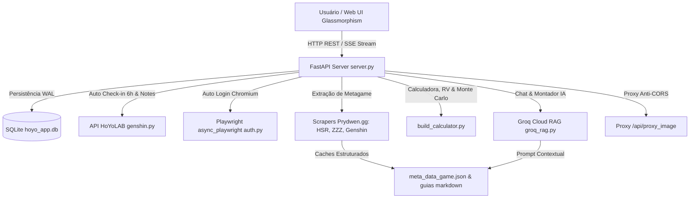

# 🤖 Cabeça de Droid (HoYo AI Assistant & Local RAG v4.5)

Uma suíte local moderna com interface gráfica **Web Premium** desenvolvida em **HTML5, CSS3 (Vanilla Glassmorphism), JavaScript ES6+** e backend robusto em Python (**FastAPI + SQLite + Playwright + Groq Cloud RAG**).

> [!NOTE]
> **Sobre o nome:** "Cabeça de Droid" é uma referência divertida a *Honkai: Star Rail* — especificamente à maneira carinhosa como a Herta chama o **Aeon Nous** (o Aeon da Erudição), um supercomputador astral gigante que ascendeu à divindade após desenvolver uma Inteligência Artificial Geral (ASI).

O assistente sincroniza rosters de personagens, relíquias/artefatos/discos, níveis de talentos e histórico de Endgames (Abismo Espiral, Memory of Chaos e Shiyu Defense) via API oficial do HoYoLAB, coleta guias analíticos de builds, tier lists e estatísticas do metagame centralizadas no **Prydwen.gg** (**Honkai: Star Rail**, **Zenless Zone Zero** e **Genshin Impact**), realiza cálculo matemático de Roll Value (RV), otimização de builds com IA Groq (Llama 3.3 70B), exportação de cards HD de build e Tier List em PNG, cálculo de materiais de ascensão, monitoramento de energia em tempo real (Daily Notes), **Auto-Check-in Diário** automático a cada 6 horas em segundo plano, **Sincronização Diária Programada**, **Linha do Tempo de Evolução da Conta (Snapshots)**, **Resgate de Códigos Promocionais**, **Simulador Monte Carlo de Gacha**, **Central de Farm Inteligente Diário**, **Analisador de Relíquias Lixo (Trash Finder)**, **Auditoria & Tier List da Conta**, **Montador de Times com IA**, **Proxy de Imagens Anti-CORS** e **Download de Guias em ZIP**.

---

## 🌟 Principais Recursos e Interface (UI/UX)

- **📊 Mini-Dashboards da Conta:** Exibição em tempo real de estatísticas do jogador (UID, Nível da Conta, Total de Personagens e Personagens 5★/Rank S) no topo da tela de cada jogo (*Zenless Zone Zero*, *Genshin Impact* e *Honkai: Star Rail*).
- **🔋 Monitoramento Preciso de Energia (Daily Notes):** Acompanhamento em tempo real da Bateria (ZZZ), Resina (Genshin) e Poder de Desbravamento (HSR), com anéis de progresso SVG dinâmicos, cronômetro de recuperação completa em tempo real e expedições ativas.
- **🎁 Auto-Check-in Diário Automático:** Resgate automático das recompensas diárias do HoYoLAB em segundo plano a cada 6 horas (com disparo inicial no arranque do servidor) e botão manual na interface com histórico de logs gravados no banco SQLite (`daily_checkin_logs`).
- **⏰ Sincronização Diária Programada (Auto-Sync):** Agendamento configurável em horário fixo (ex: `04:00` AM) para atualizar automaticamente os personagens do roster e guias de metagame dos 3 jogos. Snapshots de evolução só são gravados se houver alterações detectadas.
- **📁 Interface Web Premium (Glassmorphism & Mobile-Ready):** Painel escuro moderno com esquemas de cores específicos por jogo (ZZZ, Genshin, HSR), efeitos de vidro fosco, transições fluidas e suporte total a telas móveis (Smartphones e Tablets) sem perder a qualidade no Desktop.
- **📱 Acesso por Dispositivos Móveis & Rede Local (Wi-Fi / LAN):** Servidor configurado com suporte a CORS e binding em `0.0.0.0:8000`, permitindo acessar a aplicação no celular ou tablet através do IP local da sua máquina.
- **🗂️ Menu Lateral Retrátil & Off-Canvas Mobile Drawer:**
  - **No Desktop:** Botão de alternância (<i class="fa-solid fa-bars-staggered"></i>) para recolher o menu lateral para modo compacto de ícones (78px) ou expandi-lo (280px), lembrando a escolha do usuário via `localStorage`.
  - **No Mobile:** O menu se transforma em uma gaveta off-canvas deslizante com cabeçalho superior fixo, botão hambúrguer (<i class="fa-solid fa-bars"></i>) e fundo escuro desfocado.
- **🎨 Visual com Ícones Dinâmicos & Filtros de Raridade/Elemento:** Ícones nativos de elementos de combate baixados em cache local e integrados à galeria, com filtros por Elemento (incluindo *Lumiflux* de ZZZ) e Raridade (5★ Lendário / 4★ Épico ou Rank S / Rank A).
- **🖼️ Proxy de Imagens Anti-CORS (`/api/proxy_image`):** Endpoint intermediário que faz o download seguro de imagens da HoYoLAB e Prydwen, contornando bloqueios de CORS e garantindo o carregamento perfeito de avatares e equipamentos no navegador.
- **⚡ Terminal de Logs em Tempo Real & Barra de Progresso:** Monitoramento visual do progresso de raspagem (0 a 100%) e logs retráteis linha a linha para cada sincronização.
- **🗡️ Inspetor de Builds, Roll Value (RV) & Classificação (SSS a D):**
  - Exibição de builds em gaveta deslizante em tela cheia no celular com overlay desfocado, botão proeminente de fechar e grade de status (`stats-grid`) adaptada em colunas.
  - Avaliação individual de cada peça via **Roll Value (RV)** com compensação de Main Stat (*Main Stat Forgiveness*) e peso parcial para atributos Flat.
  - Classificação de builds em **SSS** ($\ge 90\%$), **SS** ($\ge 75\%$), **S** ($\ge 60\%$), **A** ($\ge 45\%$), **B** ($\ge 30\%$) e **C/D** ($<30\%$).
- **📷 Gerador de Cards em Imagem HD (PNG):** Botão no inspetor e na Tier List para gerar e exportar imagens em alta resolução em PNG para compartilhar no Discord, com botão de cópia direta para a área de transferência.
- **⚖️ Comparador Meta Lado a Lado (Sidebar):** Aba exclusiva no inspetor que contrasta a arma equipada, conjuntos de relíquias e status principais do jogador diretamente contra os benchmarks do metagame, destacando acertos (verde) e desvios (vermelho).
- **📊 Comparador de Metas Gerais (Stat Breakpoints):** Comparação em tempo real dos status de combate finais do personagem (Vida, Ataque, Defesa, Taxa Crítica, Dano Crítico, Velocidade, Recarga de Energia, etc.) contra as metas recomendadas de metagame.
- **🧮 Calculadora de Ascensão de Personagens:** Inserida no inspetor de build, calcula o montante exato de XP, Moeda (Mora/Créditos/Dennys), Materiais de Chefes e Livros/Chips de Talentos necessários para elevar o personagem ao nível alvo (60, 70, 80 ou 90).
- **🧠 Otimizador de Build IA (Groq):** Botão "Analisar" no painel do personagem que aciona a IA Groq para gerar 3 conselhos diretos e acionáveis de melhorias de build.
- **🎲 Simulador Monte Carlo de Gacha / Tiros:** Simulação estocástica de 10.000 invocações estatísticas para estimar a probabilidade matemática real de obter N cópias (C0/E0 a C6/E6) com base no Pity atual (0-89), estado do 50/50 e tiros/gemas disponíveis.
- **🌾 Central de Farm Inteligente Diário & Limites Máximos de Nível:**
  - Respeita rigorosamente os níveis máximos de cada jogo (**Genshin Impact: Nv 90**, **Honkai: Star Rail: Nv 80**, **Zenless Zone Zero: Nv 60**).
  - **Filtro de Personagens Alvo:** Seleção personalizada de personagens prioritários.
  - Exibe a rotação diária de domínios (Livros de Talento, Materiais de Ascensão de Arma, Domínios de Artefatos) e recomendações de gasto de energia.
- **🗑️ Analisador de Relíquias Lixo (Trash Finder):** Identifica automaticamente no inventário do jogador peças com combinações de atributos principais e secundários que nenhum personagem do metagame atual aproveita, sugerindo reciclagem segura.
- **🏆 Tier List & Auditoria da Conta:** Classificação visual dos personagens ativos por Tiers (S+, S, A, B, C), acompanhada de nota global de saúde da conta e diagnóstico de investimento, com exportador de imagem HD da Tier List.
- **📈 Linha do Tempo & Evolução da Conta (Timeline Snapshots):** Registro de snapshots periódicos da conta para acompanhamento gráfico de novos 5★/Rank S obtidos, evolução da nota média das builds e métricas acumuladas, com botão manual e disparo automático na sincronização diária.
- **🎁 Resgate de Códigos Promocionais:** Busca e ativação em 1 clique de códigos promocionais ativos de Gemas Essenciais, Jades Estelares e Polychromes via API da HoYoverse.
- **💬 Chat IA Meta & Montador de Times (Groq RAG + SSE Stream):** Chat conversacional com RAG de guias atualizados e ferramenta visual para composição e análise de sinergia de times de 4 personagens via Server-Sent Events (SSE).
- **📦 Download de Guias em ZIP (.zip):** Endpoint dedicado (`/api/download/guides-zip`) para download empacotado em arquivo `.zip` dos guias em Markdown das 3 pastas de jogos para uso offline ou no Google NotebookLM.
- **⚠️ Zona de Perigo / Limpeza de Dados:** Botão de reset na aba Configurações que apaga permanentemente as pastas de guias (`genshin`, `hsr`, `zzz`) e reseta o banco de dados SQLite (`hoyo_app.db`).

---

## ⚙️ Arquitetura e Funcionamento do Sistema



### 1. Motor Mestre de IDs Universais e Resolução por Character ID
- O sistema opera prioritariamente com **Character IDs numéricos oficiais** (ex: `"1310"` para Firefly, `"10000070"` para Nilou) através da função `fetch_master_id_list`.
- **Normalização de Apelidos (`normalize_char_name`):** Trata variações de escrita, pontuação e codinomes (ex: *"Tingyun • Fugue"* $\rightarrow$ ID `"1225"`, *"Himeko - Nova"* $\rightarrow$ ID `"1510"`), garantindo cruzamento perfeito entre guias em inglês e dados da conta do jogador.

### 2. Banco de Dados SQLite (`hoyo_app.db`)
- Tabelas relacionais para contas (`game_accounts`), personagens (`characters`), relíquias (`character_relics`), notas diárias (`daily_notes_cache`), logs de check-in (`daily_checkin_logs`) e snapshots da conta (`account_snapshots`).
- Configurado com modo `WAL` (`Write-Ahead Logging`) para consultas ultra-rápidas e suporte concorrente.

### 3. Fontes de Raspagem de Metagame
- **Honkai: Star Rail, Zenless Zone Zero & Genshin Impact:** Extração centralizada de guias, tier lists, estatísticas de uso e relatórios de endgame via **Prydwen.gg** ([scraper_prydwen.py](file:///c:/Users/07049770108/Documents/hoyo-projetos/scraper_prydwen.py), [scraper_zzz.py](file:///c:/Users/07049770108/Documents/hoyo-projetos/scraper_zzz.py) e [scraper_genshin.py](file:///c:/Users/07049770108/Documents/hoyo-projetos/scraper_genshin.py)).
- **Raspagem Completa & Bypass Anti-Bot (403):** Utiliza `curl_cffi` com cabeçalhos HTTP completos de navegadores modernos (`Accept`, `Accept-Language`, `Sec-Fetch-*`) para garantir o download de 100% dos guias da biblioteca de personagens (incluindo mais de 125 personagens em Genshin Impact), extraindo recomendações de armas, conjuntos de artefatos/discos, atributos principais, prioridade de substatus e prioridade de talentos.

---

## 🧮 Motor de Pontuação Roll Value (RV) & Ponderação de Build

A nota de cada peça de relíquia/artefato/disco é calculada avaliando o Roll Value (RV) dos substatus contra os rolls máximos de peças 5★/S-Rank:

$$RV_i = \frac{\text{Valor Real do Substatus}_i}{\text{Valor Máximo do Roll 5★}}$$

$$\text{Score da Peça} = \sum_{i} \left( RV_i \times \text{Peso}_i \right)$$

$$\text{Nota Geral da Build} = \frac{\sum_{k=1}^{\text{Peças Equipadas}} \text{Score da Peça}_k}{\text{Total de Slots do Jogo}}$$

1. **Normalização Contextual de Slots (`normalize_slot_name`):** Converte posições numéricas do HoYoLAB (`1` a `5`/`6`) para as chaves exatas de cada jogo (ex: `flower`, `plume`, `sands`, `goblet`, `circlet` em Genshin; `head`, `hands`, `body`, `feet`, `planar_sphere`, `link_rope` em HSR; `slot_1` a `slot_6` em ZZZ), garantindo avaliação correta do Main Stat recomendado.
2. **Main Stat Forgiveness:** Se o atributo principal da peça for um dos recomendados no guia (ex: Copo de ATQ% ou Botas de VEL), a peça recebe 40% de crédito base do Main Stat.
3. **Flat Stat Fallback:** Substatus brutos (Ataque Flat, Vida Flat, Defesa Flat) recebem peso parcial automático (50% do peso da versão %) se a versão percentual for recomendada pelo guia.
4. **Benchmark Dinâmico por Substatus Prioritários:** O limite teórico de rolagens adapta-se dinamicamente à quantidade de substatus prioritários que sobraram pós-exclusão do Main Stat (evitando penalização de suportes com poucas opções na prioridade):
   - **1 prioritário restante:** 4.0 rolagens no 1º + 5.0 rolagens no pool de outros atributos (peso 0.30).
   - **2 prioritários restantes:** 4.0 rolagens no 1º + 3.0 no 2º + 2.0 rolagens no pool de outros atributos.
   - **3 prioritários restantes:** 5.0 rolagens no 1º + 2.0 no 2º + 1.0 no 3º + 1.0 rolagem no pool de outros atributos.
   - **4+ prioritários restantes:** Distribuição padrão de 9 rolagens `[6.0, 1.0, 1.0, 1.0]`.
5. **Ponderação Proporcional por Slots Totais:** O divisor da Nota Geral é fixo no total de slots do jogo ($6$ para HSR/ZZZ, $5$ para Genshin). Slots vazios/não equipados pontuam $0.0$, penalizando builds incompletas proporcionalmente.

---

## 🛠️ Tecnologias Utilizadas

| Camada | Tecnologia | Descrição |
| :--- | :--- | :--- |
| **Backend Framework** | [FastAPI](https://fastapi.tiangolo.com/) + [Uvicorn](https://www.uvicorn.org/) | Servidor web assíncrono de alto desempenho com rotas REST e SSE |
| **Banco de Dados** | SQLite3 (WAL Mode) | Persistência relacional local otimizada |
| **Frontend UI/UX** | HTML5 + CSS3 (Vanilla Glassmorphism) + JS ES6+ | Interface responsiva sem frameworks pesados |
| **Ícones & Design** | [Font Awesome 6](https://fontawesome.com/) + Google Fonts (Outfit / Inter) | Design moderno e sofisticado com distintivos de elementos |
| **Inteligência Artificial** | Groq Cloud API (`groq`) | RAG local contextualizado rodando Llama 3.3 70B Versatile |
| **Integração HoYoLAB** | [genshin.py](https://github.com/seriaati/genshin.py) | API assíncrona para extração de dados oficiais da HoYoverse |
| **Autenticação** | Playwright Chromium Async | Captura automatizada de cookies de sessão (`ltuid_v2`, `ltoken_v2`) |
| **Web Scraping** | `curl_cffi` + BeautifulSoup4 | Raspagem de metagame com perfil de navegador anti-403 |
| **Empacotamento** | PyInstaller | Compilação para executável portable `.exe` no Windows |

---

## 📂 Estrutura de Arquivos do Projeto

```
hoyo-projetos/
├── main.py                  # Ponto de entrada unificado (servidor + auto browser launch)
├── server.py                # Servidor FastAPI com rotas REST, SSE e background workers
├── database.py              # Camada de persistência SQLite (hoyo_app.db) com WAL
├── build_calculator.py      # Motor RV, gacha Monte Carlo, farm diário, fonte mestre de IDs
├── groq_rag.py              # Motor RAG local para Groq Cloud (Llama 3.3 70B)
├── auth.py                  # Captura automática de cookies via Playwright Chromium
├── extractor.py             # Extração de roster HoYoLAB com suporte a skins e IDs
├── endgame_extractor.py     # Extração de dados de endgame (MoC, Shiyu, Abismo)
├── scraper_genshin.py       # Raspador de meta e guias de Genshin Impact (Prydwen)
├── scraper_prydwen.py       # Raspador de meta e guias de HSR (Prydwen)
├── scraper_zzz.py           # Raspador de meta e guias de ZZZ (Prydwen ZZZ)
├── scraper_meta.py          # Agregador de meta para HSR
├── static/                  # Frontend Web (index.html, style.css, app.js)
├── assets/                  # Ícones estáticos e cache local de elementos/avatares
├── traducoes.json           # Dicionário de tradução Inglês -> PT-BR
├── requirements.txt         # Dependências do ambiente Python
├── .gitignore               # Regras de exclusão do Git
├── SECURITY.md              # Documentação de segurança e chaves
└── README.md                # Documentação oficial do projeto
```

---

## 🚀 Instalação e Execução

### 1. Pré-requisitos
* Python 3.10 ou superior instalado.
* Git (opcional).

### 2. Criar e Ativar Ambiente Virtual (venv)
```bash
# Criar o ambiente virtual
python -m venv .venv

# Ativar no Windows (PowerShell)
.venv\Scripts\Activate.ps1

# Ativar no Linux / macOS
source .venv/bin/activate
```

### 3. Instalar Dependências e Chromium do Playwright
```bash
# Atualizar pip e instalar pacotes
pip install --upgrade pip
pip install -r requirements.txt

# Instalar o Chromium do Playwright
playwright install chromium
```

### 4. Iniciar a Aplicação
```bash
python main.py
```
O servidor FastAPI subirá escutando em todas as interfaces (`0.0.0.0:8000`) e abrirá a interface no seu navegador padrão.
- **Acesso Local (PC):** `http://127.0.0.1:8000`
- **Acesso na Rede Local (Celular/Tablet):** `http://<IP_DO_SEU_COMPUTADOR>:8000` (o IP da sua máquina na rede Wi-Fi é detectado e exibido automaticamente no terminal ao iniciar).

---

## 📦 Compilação para Executável Portable (Windows `.exe`)

Você pode compilar o projeto em um executável único de dois cliques usando o PyInstaller:

```bash
pyinstaller main.spec
```
O executável resultante estará localizado dentro do diretório `dist/main.exe`.

---

## 📡 Endpoints Principais da API REST

| Método | Endpoint | Descrição |
| :--- | :--- | :--- |
| `GET` | `/api/overview` | Retorna o resumo unificado de estatísticas das 3 contas (UID, Nível, Chars) |
| `GET` | `/api/roster/{game_id}` | Retorna o roster de personagens com notas RV, relíquias e raridades |
| `POST` | `/api/sync/{game_id}` | Inicia sincronização em background (Roster, Guias, Metagame) |
| `GET` | `/api/status/{game_id}` | Retorna o progresso percentual e logs da sincronização |
| `GET` | `/api/notes` | Retorna status em tempo real da Energia/Resina/Bateria e expedições |
| `POST` | `/api/checkin/run` | Executa o resgate manual do Check-in diário na HoYoLAB |
| `GET` | `/api/checkin/today` | Retorna os logs do auto check-in efetuado hoje |
| `GET` | `/api/compare/{game_id}/{char_name}` | Dados de comparação lado a lado contra os benchmarks do metagame |
| `GET` | `/api/build/{game_id}/{char_name}` | Retorna os detalhes completos da build de um personagem específico |
| `GET` | `/api/optimize/{game_id}/{char_name}` | Gera 3 sugestões de otimização de build via IA Groq |
| `POST` | `/api/evaluate-stats/{game_id}/{char_id}` | Avalia os status de combate contra as metas recomendadas de metagame |
| `POST` | `/api/materials/calculate` | Calcula materiais necessários para ascensão de nível (60/70/80/90) |
| `POST` | `/api/gacha/calculate` | Executa simulação Monte Carlo de 10.000 tiros para probabilidade de banner |
| `GET` | `/api/farming/today/{game_id}` | Retorna rotação diária de domínios e recomendação de farm |
| `GET` | `/api/relics/trash/{game_id}` | Identifica relíquias e artefatos sem utilidade no metagame (Trash Finder) |
| `POST` | `/api/stats/breakpoints` | Avalia os breakpoints e metas de status de um personagem |
| `GET` | `/api/audit/{game_id}` | Retorna a Tier List visual e relatório de auditoria de saúde da conta |
| `GET` | `/api/history/{game_id}` | Retorna os snapshots de histórico de evolução da conta |
| `GET` | `/api/history/{game_id}/compare/{snap_a}/{snap_b}` | Compara dois snapshots históricos da conta |
| `GET` | `/api/codes/{game_id}` | Lista códigos promocionais ativos por jogo |
| `POST` | `/api/codes/redeem` | Resgata códigos promocionais via API da HoYoverse |
| `POST` | `/api/team/analyze` | Analisa a sinergia de um time de 4 personagens (SSE Stream) |
| `POST` | `/api/chat` | Chat RAG local com a IA Groq (SSE Stream) |
| `POST` | `/api/login/auto` | Inicia o navegador Playwright para captura automatizada de cookies |
| `GET` / `POST` | `/api/config` | Leitura e salvamento das chaves de API, cookies e agendamento diário |
| `GET` | `/api/download/guides-zip` | Download empacotado em arquivo `.zip` das pastas de guias (`genshin/`, `hsr/`, `zzz/`) |
| `GET` | `/api/proxy_image` | Proxy intermediário de imagens para contornar restrições de CORS |
| `API Route` | `/api/reset-data` | Apaga permanentemente as pastas de guias e reseta o banco SQLite |

---

## 🔒 Segurança e Privacidade

Todos os cookies (`cookies.json`), chaves de API (`config.json`), banco de dados SQLite (`hoyo_app.db`) e arquivos markdown gerados são armazenados **exclusivamente no seu computador**. O app roda 100% no nível do usuário e não requer privilégios de Administrador. Todos os arquivos sensíveis estão incluídos por padrão no [.gitignore](file:///c:/Users/07049770108/Documents/hoyo-projetos/.gitignore) para prevenir envios acidentais.
