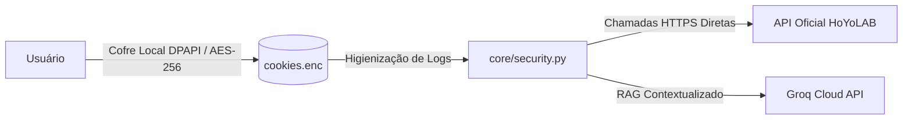
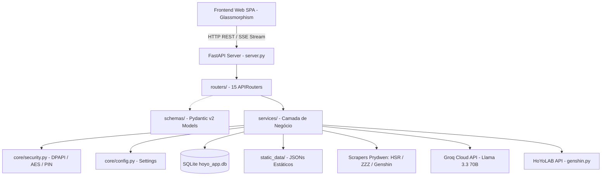

# 🤖 Cabeça de Droid (HoYo AI Assistant & Local RAG v5.0)

[](https://www.python.org/)
[](https://fastapi.tiangolo.com/)
[](LICENSE)
[](tests/)
[](SECURITY.md)

Suíte local inteligente com interface gráfica **Web Glassmorphism** (HTML5/CSS3/ES6+) e backend modular em Python (**FastAPI + Clean Architecture + SQLite + Playwright + Groq Cloud RAG + Windows DPAPI Security Vault + Zero-Maintenance Datamines**).

> [!NOTE]
> **Sobre o nome:** "Cabeça de Droid" é uma referência a *Honkai: Star Rail* — o apelido carinhoso que Herta dá ao **Aeon Nous** (o Aeon da Erudição), um supercomputador astral que ascendeu à divindade.

---

## ⚡ Início Rápido (Quick Start em 3 Passos)

```bash
# 1. Clonar e entrar no repositório
git clone https://github.com/Lacas0010/Cabeca_de_Droid.git
cd Cabeca_de_Droid

# 2. Criar ambiente virtual e instalar dependências
python -m venv .venv
.\.venv\Scripts\Activate.ps1   # Linux/macOS: source .venv/bin/activate
pip install -r requirements.txt
playwright install chromium

# 3. Executar o aplicativo
python main.py
```

* **Acesso Local (PC):** `http://127.0.0.1:8000`
* **Acesso no Celular/Tablet (Rede Wi-Fi):** `http://<IP_DO_SEU_PC>:8000` *(habilitável em Configurações)*
* **Rodar Testes:** `.\.venv\Scripts\python.exe -m unittest discover` *(74 testes unitários inclusos)*

---

## 🌟 Recursos Principais

| Módulo | Ícone | O que faz? |
| :--- | :---: | :--- |
| **1. Mini-Dashboards** | 📊 | Visão geral da conta (UID, Nível, Total de Personagens e 5★/Rank S) para Genshin, HSR e ZZZ. |
| **2. Monitor de Energia** | 🔋 | Monitor de Resina, Poder de Desbravamento e Bateria com anéis SVG e contagem regressiva. |
| **3. Auto Check-in 6h** | 🎁 | Resgate automático das recompensas diárias da HoYoLAB a cada 6h gravado no SQLite. |
| **4. Auto-Sync 04:00** | ⏰ | Agendamento diário automático para atualizar Roster e guias com detecção de diffs. |
| **5. Interface Glassmorphism** | 📁 | Painel escuro moderno, temas por jogo e gaveta off-canvas deslizante no mobile. |
| **6. Acesso LAN / Wi-Fi** | 📱 | Binding `0.0.0.0:8000` sob demanda para uso no smartphone ou tablet na rede local. |
| **7. Galeria com Ícones Oficiais** | 🎨 | Filtros por Elemento (incluindo *Lumiflux* de ZZZ) e Raridade com avatares em cache local. |
| **8. Proxy Anti-CORS** | 🖼️ | Endpoint `/api/proxy_image` para carregamento seguro de imagens em Canvas 2D. |
| **9. Tracker de Endgame** | ⚔️ | Histórico de Abismo Espiral, Teatro Imaginário, MoC, Pura Ficção, Sombra e Defesa Shiyu. |
| **10. Inspetor de Builds Centralizado** | 🗡️ | Janela modal centralizada em 2 colunas, avaliação por Roll Value (RV), Main Stat Forgiveness e notas de **SSS** a **D**. |
| **11. Eidolons & Shards (HSR)** | 💎 | Fragmentos de arte in-game nos nós de Eidolon e suporte a splash arts de skins (Sparkle, Robin). |
| **12. Mindscapes & Habilidades (ZZZ)** | ⚡ | Ícones de Cinema Mental 01-06 em neon e categorias oficiais de combate (Básico, Especial, Esquiva, etc.). |
| **13. Tooltips & Descrições Ricas** | ✨ | Hover action com descrições detalhadas e completas de Talentos, Rastros e Habilidades sem tags HTML. |
| **14. Exportação em Imagem HD** | 📷 | Renderização em **4K (2400 × 1350 px)** de Cards de Build, Tier List e Diffs de Evolução. |
| **15. Breakpoints de Combate** | ⚖️ | Comparador de metas de combate recomendadas no metagame (verde = meta atingida). |
| **16. Calculadora de Ascensão** | 🧮 | Cálculo exato de Mora, XP e materiais com caps reais (**Genshin 90**, **HSR 80**, **ZZZ 60**). |
| **17. Otimizador IA Groq** | 🧠 | Consultoria instantânea com Llama 3.3 70B gerando 3 melhorias prioritárias para a build. |
| **18. Diagnóstico de Lacunas** | 🔥 | Mapeamento de fraquezas da conta (DPS/Sustento/Elemento) e modo Roast sarcástico. |
| **19. Índice de Sorte (Luck Score)** | 🍀 | Medidor de RNG da conta (SSS+ a F), destacando a peça **God Roll #1** e a **Cursed Roll**. |
| **20. Gacha Monte Carlo** | 🎲 | Simulação de 10.000 tiros com Soft Pity real (74+), desconto de cópias e projeção de metas. |
| **21. Central de Farm & OS Diária** | 🌾 | Domínios abertos hoje e Ordem de Serviço Diária com alocação inteligente de resina. |
| **22. Trash Finder & Síntese** | 🗑️ | Varredura de relíquias sem utilidade no meta e conselheiro de criação com Resina Automodeladora. |
| **23. Chat IA & Montador de Times**| 💬 | Chat RAG conversacional e montador de times de 4 slots com análise SSE Streaming. |

---

## 🍪 Segurança de Dados & Cookies HoYoLAB

O aplicativo utiliza cookies de sessão oficiais (`ltuid_v2`, `ltoken_v2`, `cookie_token_v2`) para interagir com a HoYoverse sem exigir login por senha.


```mermaid
graph LR
    User[Usuário] -->|Cofre Local DPAPI / AES-256| Vault[(cookies.enc)]
    Vault -->|Higienização de Logs| San[core/security.py]
    San -->|Chamadas HTTPS Diretas| HoYo[API Oficial HoYoLAB]
    San -->|RAG Contextualizado| Groq[Groq Cloud API]
```

### Resumo de Privacidade
* **Senhas e `stoken`:** **NUNCA** solicitados ou armazenados.
* **Criptografia em Repouso:** Arquivos `.enc` criptografados nativamente no Windows via **DPAPI** e no Linux via **AES-256/HMAC**.
* **Zero-Exposure no Frontend:** A interface gráfica exibe apenas tokens mascarados (ex: `ltuid_v2=282***47; ltoken_v2=v2_CA***JkXB`).
* **Higienização de Logs:** Filtro regex automático censura segredos antes de qualquer saída no terminal ou SSE.

Para detalhes completos de governança e modelagem de ameaças, leia o [SECURITY.md](SECURITY.md).

---

## ⚙️ Arquitetura do Sistema (Clean Architecture)


```mermaid
graph TD
    UI[Frontend Web SPA - Glassmorphism] -->|HTTP REST / SSE Stream| Server[FastAPI Server - server.py]
    Server --> Routers[routers/ - 15 APIRouters]
    
    Routers -.-> Schemas[schemas/ - Pydantic v2 Models]
    Routers --> Services[services/ - Camada de Negócio]
    
    Services --> CoreSec[core/security.py - DPAPI / AES / PIN]
    Services --> CoreCfg[core/config.py - Settings]
    Services --> DB[(SQLite hoyo_app.db)]
    Services --> StaticData[static_data/ - JSONs Estáticos]
    Services --> Scrapers[Scrapers Prydwen: HSR / ZZZ / Genshin]
    Services --> GroqAI[Groq Cloud API - Llama 3.3 70B]
    Services --> HoYoAPI[HoYoLAB API - genshin.py]
```

---

## 📂 Estrutura Modular do Projeto

```
hoyo-projetos/
├── core/                    # Infraestrutura, configurações e segurança criptográfica
├── schemas/                 # Contratos tipados Pydantic v2 (validação de entrada e saída)
├── services/                # Regras de negócio desacopladas (Sync, Checkin, Gacha, Roster, Codes)
├── routers/                 # 15 Controladores REST FastAPI (APIRouter)
├── static_data/             # Catálogos de personagens, domínios e regras em JSON puro
├── static/                  # Frontend Web SPA (index.html, style.css, app.js)
├── assets/                  # Ícones oficiais de elementos e avatares em cache local
├── tests/                   # 62 testes unitários cobrindo todos os módulos
├── server.py                # Orquestrador FastAPI modular com ciclo de vida
└── main.py                  # Entrypoint de inicialização da aplicação
```

---

## 🧮 Motor de Pontuação Roll Value (RV)

$$
RV_i = \frac{\text{Valor Real do Substatus}_i}{\text{Valor Máximo do Roll 5★}} \quad\implies\quad \text{Score} = \sum_{i} \left( RV_i \times \text{Peso}_i \right)
$$

* **Main Stat Forgiveness:** +40% de bônus base se o atributo principal for o recomendado no metagame.
* **Flat Stat Fallback:** Atributos Flat (ATQ, Vida, DEF) recebem 50% de crédito automático da versão %.
* **Classificação:** **SSS** ($\ge 90\%$), **SS** ($\ge 75\%$), **S** ($\ge 60\%$), **A** ($\ge 45\%$), **B** ($\ge 30\%$), **C/D** ($<30\%$).

---

## 📡 Endpoints Principais da API REST

| Método | Endpoint | Descrição |
| :--- | :--- | :--- |
| `GET` | `/api/overview` | Estatísticas unificadas das contas (UID, Nível, Chars) |
| `GET` | `/api/security/status` | Status do cofre DPAPI, autenticação por PIN e isolamento LAN |
| `POST` | `/api/security/pin/verify` | Validação de PIN e emissão de sessão segura |
| `GET` | `/api/roster/{game_id}` | Roster completo com builds, notas RV e relíquias |
| `GET` | `/api/build/{game_id}/{char_name}` | Dados completos da build (armas, relíquias, status, habilidades e ranks) |
| `GET` | `/api/compare/{game_id}/{char_name}` | Comparador da build do jogador com a meta recomendada |
| `GET` | `/api/optimize/{game_id}/{char_name}` | Sugestões inteligentes de otimização de build geradas via IA |
| `POST` | `/api/sync/{game_id}` | Inicia sincronização assíncrona de Roster e Metagame |
| `GET` | `/api/notes` | Monitor de energia/resina/bateria em tempo real |
| `POST` | `/api/checkin/run` | Executa o check-in diário na HoYoLAB |
| `POST` | `/api/gacha/forecast/calculate` | Simulação Monte Carlo e projeção de tiros para banners |
| `GET` | `/api/strategy/account-gaps/{game_id}` | Diagnóstico de lacunas de arquétipos e cobertura elemental |
| `GET` | `/api/farm/order-of-day/{game_id}` | Ordem de Serviço Diária com alocação otimizada de resina |
| `GET` | `/api/relics/craft-recommendations/{game_id}`| Recomendações de síntese com Resina Automodeladora |
| `GET` | `/api/briefing/today` | Morning Briefing executivo diário |
| `POST` | `/api/codes/redeem` | Resgate em lote de códigos promocionais ativos |
| `POST` | `/api/team/analyze` | Análise de sinergia de equipes de 4 slots via SSE Stream |
| `POST` | `/api/chat` | Chat conversacional RAG com Groq Llama 3.3 70B (SSE) |

---

## 📄 Governança, Licença e Contribuição

* **Licença:** Distribuído sob a licença [MIT](LICENSE).
* **Guia de Contribuição:** Para padrões de código, fluxo de PR e guia de testes, consulte o [CONTRIBUTING.md](CONTRIBUTING.md).
* **Histórico de Mudanças:** Consulte o [CHANGELOG.md](CHANGELOG.md) para a lista de novidades de cada versão.
* **Segurança:** Leia o [SECURITY.md](SECURITY.md) para detalhes de criptografia e reporte de vulnerabilidades.
