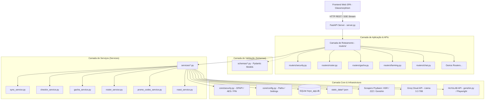

# 🤖 Cabeça de Droid (HoYo AI Assistant & Local RAG v5.0)

Uma suíte local moderna com interface gráfica **Web Premium** desenvolvida em **HTML5, CSS3 (Vanilla Glassmorphism), JavaScript ES6+** e arquitetura modular limpa em Python (**FastAPI + Clean Architecture + SQLite + Playwright + Groq Cloud RAG + Windows DPAPI Security Vault**).

> [!NOTE]
> **Sobre o nome:** "Cabeça de Droid" é uma referência divertida a *Honkai: Star Rail* — especificamente à maneira carinhosa como a Herta chama o **Aeon Nous** (o Aeon da Erudição), um supercomputador astral gigante que ascendeu à divindade após desenvolver uma Inteligência Artificial Geral (ASI).

---

## 📌 Contexto do Projeto

Este projeto nasceu como uma ferramenta pessoal para organizar rosters, guias e dados de jogos da HoYoverse (*Genshin Impact*, *Honkai: Star Rail* e *Zenless Zone Zero*) e integrá-los a uma IA para análise contextualizada e otimização de builds.

O código está público principalmente por interesse em open source, compartilhamento de ideias e boas práticas de arquitetura de software limpa em Python. O sistema opera de forma 100% local, independente e sem telemetria externa.

A compatibilidade pode variar conforme mudanças nas APIs públicas da HoYoverse, nas fontes externas de dados (como Prydwen.gg) e em atualizações dos próprios jogos.

---

## 🍪 Cookies HoYoLAB: Coleta, Finalidade e Segurança

Para interagir com as APIs públicas e oficiais da HoYoverse sem exigir senhas ou credenciais de login, o aplicativo utiliza cookies de sessão web (`ltuid_v2`, `ltoken_v2`, `cookie_token_v2`).

### Quais cookies são utilizados e para que servem?

| Cookie | Finalidade na Aplicação | Nível de Sensibilidade | O que permite fazer? |
| :--- | :--- | :--- | :--- |
| `ltuid_v2` / `account_id_v2` | Identificador público da conta no HoYoLAB | Baixo | Identificar o perfil e associar os UIDs dos jogos vinculados. |
| `ltoken_v2` | Leitura de dados de jogo e Daily Notes | **Médio / Leitura de Sessão** | Ler seu Roster de personagens, relíquias, notas diárias (resina/energia/bateria) e efetuar o check-in diário. |
| `cookie_token_v2` | Ações web da conta | **Médio / Web Token** | Resgatar códigos promocionais ativos e consultar dados web. |
| **Senha / stoken** | **NUNCA COLETADOS OU ARMAZENADOS** | **Crítico** | O Cabeça de Droid **não** pede nem armazena senhas, e-mails de login ou `stoken` (token mestre de alteração de senha/troca de conta). |

### ⚠️ Avisos de Risco e Boas Práticas

> [!CAUTION]
> **Atenção aos Riscos:**
> - Mesmo que esses tokens não permitam alterar diretamente a senha ou o e-mail da sua conta HoYoVerse (ações restritas a fluxos com `stoken` no aplicativo mobile oficial), eles devem ser tratados como **credenciais sensíveis de sessão**.
> - **Nunca compartilhe** seus arquivos `cookies.enc` ou valores brutos de cookies com terceiros ou em repositórios públicos.
> - Se suspeitar de qualquer exposição de tokens, basta fazer **Logout no site oficial da HoYoLAB** ou alterar sua senha para invalidar imediatamente todas as sessões ativas nos servidores da HoYoverse.

### 🛡️ Medidas de Proteção Implementadas na Aplicação

1. **Criptografia Local com Windows DPAPI (`cookies.enc`):** Seus cookies são salvos exclusivamente no seu computador com proteção nativa do sistema operacional (`CryptProtectData` via `ctypes.windll.crypt32`), atrelando a chave criptográfica ao seu perfil de login no Windows no hardware atual.
2. **Zero-Exposure no Frontend:** O servidor nunca envia cookies em texto claro para a interface web. O frontend exibe apenas resumos mascarados (ex: `ltuid_v2=282***47; ltoken_v2=v2_CA***JkXB; cookie_token_v2=***[PROTEGIDO]***`).
3. **Higienização Automática de Logs:** Todas as mensagens de terminal e logs de sincronização passam por filtros regex em tempo real ([log_sanitizer.py](core/security.py)) para censurar automaticamente tokens, chaves de API e cabeçalhos de autorização.
4. **Isolamento de Rede por Padrão (Loopback 127.0.0.1):** O servidor inicia vinculado estritamente à máquina local. O acesso por outros dispositivos na mesma rede Wi-Fi/LAN só é liberado se você habilitar explicitamente a opção nas Configurações.
5. **Autenticação Local por PIN (Opcional):** Permite configurar um PIN numérico com hash `PBKDF2-HMAC-SHA256` (120.000 iterações com salt individual) para trancar o acesso ao dashboard em computadores compartilhados.

---

## 🌟 Principais Recursos (20 Módulos Inteligentes)

1. **📊 Mini-Dashboards da Conta:** Exibição em tempo real de estatísticas do jogador (UID, Nível da Conta, Total de Personagens e Personagens 5★/Rank S) no topo da tela de cada jogo (*Zenless Zone Zero*, *Genshin Impact* e *Honkai: Star Rail*).
2. **🔋 Monitoramento Preciso de Energia (Daily Notes):** Acompanhamento em tempo real da Bateria (ZZZ), Resina (Genshin) e Poder de Desbravamento (HSR), com anéis de progresso SVG dinâmicos e contagem regressiva para recuperação completa.
3. **🎁 Auto-Check-in Diário Automático:** Resgate automático das recompensas diárias do HoYoLAB a cada 6 horas com histórico persistido em banco SQLite (`daily_checkin_logs`).
4. **⏰ Sincronização Diária Programada (Auto-Sync):** Agendamento configurável em horário fixo (ex: `04:00` AM) para atualizar automaticamente o Roster e guias de metagame dos 3 jogos com detecção inteligente de diffs.
5. **📁 Interface Web Glassmorphism & Mobile-Ready:** Painel escuro com temas específicos por jogo, efeitos de vidro fosco, gaveta off-canvas deslizante e suporte total a Smartphones e Tablets.
6. **📱 Acesso por Dispositivos Móveis & Rede Local (LAN):** Binding sob demanda em `0.0.0.0:8000`, permitindo acessar o app no celular através do IP local.
7. **🎨 Ícones Oficiais, Filtros e Galeria:** Filtros rápidos por Raridade e Elemento (incluindo *Lumiflux* de ZZZ) com ícones oficiais em cache local.
8. **🖼️ Proxy de Imagens Anti-CORS (`/api/proxy_image`):** Endpoint intermediário que faz o download seguro de avatares e equipamentos da HoYoLAB, Enka e Prydwen, viabilizando exportações em Canvas 2D sem violação de CORS.
9. **⚔️ Tracker & Histórico de Endgame:**
   - **Genshin Impact:** Abismo Espiral (*Spiral Abyss*) e Teatro Imaginário (*Imaginarium Theater*).
   - **Honkai: Star Rail:** Memória do Caos (*Memory of Chaos*), Pura Ficção (*Pure Fiction*) e Sombra Apocalíptica (*Apocalyptic Shadow*).
   - **Zenless Zone Zero:** Defesa Shiyu (*Shiyu Defense*) e *Deadly Assault*.
10. **🗡️ Inspetor de Builds, Roll Value (RV) & Notas (SSS a D):**
    - Avaliação matemática de cada peça via **Roll Value (RV)** com compensação de Main Stat (*Main Stat Forgiveness*) e peso parcial para atributos Flat.
    - Classificação de builds em **SSS** ($\ge 90\%$), **SS** ($\ge 75\%$), **S** ($\ge 60\%$), **A** ($\ge 45\%$), **B** ($\ge 30\%$) e **C/D** ($<30\%$).
11. **📷 Suíte de Exportação de Cards em Imagem HD (Canvas 2D Puro):**
    - Renderização nativa em **4K / Retina (2400 × 1350 px)**.
    - Cards de Build 16:9, Card de Tier List da Conta e Card de Evolução/Diffs com download em PNG e cópia direta para o clipboard.
12. **⚖️ Comparador Meta & Breakpoints de Combate:** Comparação lado a lado dos atributos reais do personagem contra as metas do metagame (verde = meta atingida, vermelho = defasagem).
13. **🧮 Calculadora de Ascensão com Cap Real:** Estimativa exata de materiais, Mora/Créditos e Livros de XP respeitando os limites reais de cada jogo (**Genshin: Nv 90**, **HSR: Nv 80**, **ZZZ: Nv 60**).
14. **🧠 Otimizador IA Groq (Llama 3.3 70B):** Análise instantânea gerando 3 recomendações acionáveis de melhoria de build.
15. **🔥 Diagnóstico de Lacunas (Account Gaps) & Roast IA:** Análise de cobertura elemental e de funções, acompanhada de crítica bem-humorada ("roast") da conta gerada por IA.
16. **🍀 Índice de Sorte & Eficiência de Rolagens (Luck Score):** Classificação do RNG de relíquias da conta (SSS+ a F), identificando o **God Roll #1** e o **Cursed Roll** com quebra detalhada por rolagem (+4 Perfeito, +2 Ótimo, Desperdício).
17. **🎲 Simulador Monte Carlo de Gacha & Previsão de Banners:** Simulação estocástica de 10.000 invocações com modelo real de **Soft Pity** (74+), desconto automático de cópias do Roster e metas salvas no banco.
18. **🌾 Central de Farm Inteligente & Ordem de Serviço Diária:** Rotação diária de domínios abertos, cálculo de alocação de resina e geração da Ordem de Serviço Diária.
19. **🗑️ Analisador de Relíquias Lixo & Recomendador de Síntese:** Varredura de peças inúteis no inventário (Trash Finder) e conselheiro de criação de peças com Resina Automodeladora / Elixir Santificador.
20. **💬 Chat IA Meta & Montador de Times (Groq RAG + SSE Stream):** Chat conversacional alimentado pelos guias e Roster com análise de sinergia de equipes em tempo real via Server-Sent Events.

---

## ⚙️ Arquitetura do Sistema (Clean Architecture)

O backend foi projetado com uma arquitetura modular em camadas desacopladas:


```mermaid
graph TD
    UI[Frontend Web SPA - Glassmorphism] -->|HTTP REST / SSE Stream| Server[FastAPI Server - server.py]
    Server --> Routers[Camada de Roteamento - routers/]
    
    subgraph "Camada de Aplicação & APIs"
        Routers --> R_Sec[routers/security.py]
        Routers --> R_Roster[routers/roster.py]
        Routers --> R_Gacha[routers/gacha.py]
        Routers --> R_Farm[routers/farming.py]
        Routers --> R_Chat[routers/chat.py]
        Routers --> R_Other[Outros Routers...]
    end

    subgraph "Camada de Validação (Schemas)"
        Routers -.-> Schemas[schemas/*.py - Pydantic Models]
    end

    subgraph "Camada de Serviços (Services)"
        Routers --> Services[services/*.py]
        Services --> S_Sync[sync_service.py]
        Services --> S_Checkin[checkin_service.py]
        Services --> S_Gacha[gacha_service.py]
        Services --> S_Roster[roster_service.py]
        Services --> S_Codes[promo_codes_service.py]
        Services --> S_Roast[roast_service.py]
    end

    subgraph "Camada Core & Infraestrutura"
        Services --> CoreSec[core/security.py - DPAPI / AES / PIN]
        Services --> CoreCfg[core/config.py - Paths / Settings]
        Services --> DB[(SQLite hoyo_app.db)]
        Services --> StaticData[static_data/*.json]
        Services --> Scrapers[Scrapers Prydwen: HSR / ZZZ / Genshin]
        Services --> GroqAI[Groq Cloud API - Llama 3.3 70B]
        Services --> HoYoAPI[HoYoLAB API - genshin.py / Playwright]
    end
```

---

## 📂 Estrutura de Diretórios

```
hoyo-projetos/
├── main.py                  # Entrypoint principal (inicialização do servidor + navegador)
├── server.py                # Orquestrador FastAPI modular com ciclo de vida e re-exports
├── core/                    # Camada Core de infraestrutura e configurações centrais
│   ├── config.py            # Configurações globais, paths e constantes do sistema
│   └── security.py          # Windows DPAPI, AES-GCM, PBKDF2 e sanitização de logs
├── schemas/                 # Contratos de dados Pydantic (Type safety & validação)
│   ├── auth_security.py     # Schemas para PIN, status de segurança e autenticação
│   ├── config.py            # Schemas para configuração de chaves, agendamento e webhooks
│   ├── chat.py              # Schemas para requisições de chat RAG e team builder
│   ├── sync.py              # Schemas para operações de sincronização
│   ├── gacha.py             # Schemas para cálculo Monte Carlo, previsões e metas
│   ├── farming.py           # Schemas para ordem de serviço, cálculo de materiais e passos
│   ├── codes.py             # Schemas para códigos promocionais e auto-redeem
│   └── stats.py             # Schemas para avaliação de atributos e breakpoints
├── services/                # Camada de Serviços de Negócio (Desacoplamento e Clean Architecture)
│   ├── sync_service.py      # Orquestração de sincronizações assíncronas e status
│   ├── checkin_service.py   # Execução e agendamento autônomo do check-in diário HoYoLAB
│   ├── promo_codes_service.py # Varredura e resgate automático periódico de códigos (3h)
│   ├── roster_service.py    # Consulta e agregação de personagens e builds do Roster
│   ├── endgame_service.py   # Processamento de dados de endgame (MoC, Abismo, Shiyu)
│   ├── gacha_service.py     # Simulações estocásticas Monte Carlo e metas de banners
│   ├── roast_service.py     # Geração de análises e pareceres por IA Groq Llama 3.3 70B
│   ├── media_service.py     # Proxy de imagens anti-CORS e empacotamento ZIP de guias
│   └── translation_service.py # Normalização de nomes e tradução Inglês -> PT-BR
├── routers/                 # Camada de Rotas e Controladores REST (APIRouter)
│   ├── security.py          # Rotas de segurança, PIN, DPAPI e controle de LAN
│   ├── config.py            # Rotas de configuração de sistema, webhooks e agendador
│   ├── sync.py              # Rotas de sincronização por jogo e status em tempo real
│   ├── roster.py            # Rotas de roster de personagens, comparação e otimização
│   ├── endgame.py           # Rotas de modos de endgame dos 3 jogos
│   ├── gacha.py             # Rotas do simulador de tiros Monte Carlo, previsões e metas
│   ├── farming.py           # Rotas de farm diário, ordem de serviço e ascensão
│   ├── relics.py            # Rotas de relíquias lixo (Trash Finder) e conselheiro de síntese
│   ├── strategy.py          # Rotas de diagnóstico de lacunas da conta (Account Gaps)
│   ├── codes.py             # Rotas de códigos promocionais e resgate em lote
│   ├── history.py           # Rotas da linha do tempo e comparação de snapshots
│   ├── checkin.py           # Rotas de check-in diário e histórico de logs
│   ├── chat.py              # Rotas de chat IA RAG e montador de times (SSE)
│   ├── static_data.py       # Rotas de sincronização de dados estáticos offline
│   └── system.py            # Rotas de overview, proxy de imagens, briefing e reset
├── static_data/             # Bases de dados estáticas desacopladas (JSON puro)
│   ├── character_elements.json # Mapeamento completo de elementos de combate (Genshin/ZZZ)
│   ├── known_4star_characters.json # Catálogo de personagens 4★ / Rank A dos 3 jogos
│   ├── prydwen_slug_mappings.json  # Dicionário de slugs e normalização Prydwen.gg
│   └── element_icons.json   # URLs e CDNs oficiais de ícones elementais
├── static/                  # Frontend Web SPA (index.html, style.css, app.js)
├── assets/                  # Ícones estáticos, avatares e assets da interface
├── tests/                   # Suíte de Testes Automatizados (62+ testes unitários)
│   ├── test_build_calculator.py
│   ├── test_database.py
│   ├── test_endgame_extractor.py
│   ├── test_gacha_simulator.py
│   ├── test_groq_rag.py
│   ├── test_log_sanitizer.py
│   ├── test_router_endpoints.py
│   ├── test_schemas_validation.py
│   └── test_security_vault.py
├── database.py              # Camada de persistência SQLite (hoyo_app.db) com WAL
├── build_calculator.py      # Motor RV, cálculo de atributos e utilitários de build
├── groq_rag.py              # Motor RAG local para Groq Cloud (Llama 3.3 70B)
├── auth.py                  # Captura automática de cookies via Playwright Chromium
├── extractor.py             # Extração de roster HoYoLAB com suporte a skins e IDs
├── endgame_extractor.py     # Extração de dados de endgame (MoC, Shiyu, Abismo)
├── scraper_genshin.py       # Raspador de meta e guias de Genshin Impact (Prydwen)
├── scraper_prydwen.py       # Raspador de meta e guias de HSR (Prydwen)
├── scraper_zzz.py           # Raspador de meta e guias de ZZZ (Prydwen ZZZ)
├── scraper_meta.py          # Agregador de meta para HSR
├── traducoes.json           # Dicionário de termos de metagame Inglês -> PT-BR
├── requirements.txt         # Dependências do ambiente Python
├── .gitignore               # Regras de exclusão do Git
├── SECURITY.md              # Documentação formal de governança e segurança
└── README.md                # Documentação oficial do projeto
```

---

## 🧮 Motor de Pontuação Roll Value (RV) & Ponderação de Build

A nota de cada peça de relíquia/artefato/disco é calculada avaliando o Roll Value (RV) dos substatus contra os rolls máximos de peças 5★/S-Rank:

$$
RV_i = \frac{\text{Valor Real do Substatus}_i}{\text{Valor Máximo do Roll 5★}}
$$

$$
\text{Score da Peça} = \sum_{i} \left( RV_i \times \text{Peso}_i \right)
$$

$$
\text{Nota Geral da Build} = \frac{\sum_{k=1}^{\text{Peças Equipadas}} \text{Score da Peça}_k}{\text{Total de Slots do Jogo}}
$$

1. **Normalização Contextual de Slots (`normalize_slot_name`):** Converte posições numéricas (`1` a `5`/`6`) para as chaves exatas de cada jogo (ex: `flower`, `plume`, `sands`, `goblet`, `circlet` em Genshin; `head`, `hands`, `body`, `feet`, `planar_sphere`, `link_rope` em HSR; `slot_1` a `slot_6` em ZZZ).
2. **Main Stat Forgiveness:** Se o atributo principal da peça for um dos recomendados no guia (ex: Copo de ATQ% ou Botas de VEL), a peça recebe 40% de crédito base do Main Stat.
3. **Flat Stat Fallback:** Substatus brutos (Ataque Flat, Vida Flat, Defesa Flat) recebem peso parcial automático (50% do peso da versão %) se a versão percentual for recomendada pelo guia.
4. **Benchmark Dinâmico por Substatus Prioritários:** O limite teórico de rolagens adapta-se dinamicamente à quantidade de substatus prioritários restantes.
5. **Ponderação Proporcional por Slots Totais:** O divisor da Nota Geral é fixo no total de slots do jogo ($6$ para HSR/ZZZ, $5$ para Genshin). Slots não equipados pontuam $0.0$, penalizando builds incompletas proporcionalmente.

---

## 🛠️ Tecnologias Utilizadas

| Camada | Tecnologia | Descrição |
| :--- | :--- | :--- |
| **Backend Framework** | [FastAPI](https://fastapi.tiangolo.com/) + [Uvicorn](https://www.uvicorn.org/) | Servidor web assíncrono modular com Clean Architecture, REST e SSE |
| **Validação & Tipagem** | [Pydantic v2](https://docs.pydantic.dev/) | Modelos e contratos tipados de entrada e saída com validação estrita |
| **Segurança & Cofre** | Windows DPAPI (`ctypes.windll.crypt32`) + PBKDF2 | Criptografia nativa em repouso e autenticação por PIN |
| **Higienização de Logs** | Regex Engine Sanitizer ([core/security.py](core/security.py)) | Redação e mascaramento em tempo real de tokens e chaves de API |
| **Banco de Dados** | SQLite3 (WAL Mode) | Persistência relacional local otimizada |
| **Frontend UI/UX** | HTML5 + CSS3 (Vanilla Glassmorphism) + JS ES6+ | Interface responsiva sem frameworks pesados |
| **Ícones & Design** | [Font Awesome 6](https://fontawesome.com/) + Google Fonts | Design moderno com badges de elementos e cofre de segurança |
| **Inteligência Artificial** | Groq Cloud API (`groq`) | RAG local contextualizado rodando Llama 3.3 70B Versatile |
| **Integração HoYoLAB** | [genshin.py](https://github.com/seriaati/genshin.py) | API assíncrona para extração de dados oficiais da HoYoverse |
| **Autenticação** | Playwright Chromium Async | Captura automatizada de cookies de sessão (`ltuid_v2`, `ltoken_v2`) |
| **Web Scraping** | `curl_cffi` + BeautifulSoup4 | Raspagem de metagame com perfil de navegador anti-403 |
| **Testes Automatizados** | `unittest` | Suíte de 62+ testes unitários cobrindo todos os módulos |

---

## 🚀 Instalação e Execução

### 1. Pré-requisitos

* Python 3.10 ou superior instalado.
* Git (opcional).

### 2. Criar e Ativar Ambiente Virtual (venv)

```bash
# Criar o ambiente virtual
python -m venv .venv

# Ativar no Windows (PowerShell)
.venv\Scripts\Activate.ps1

# Ativar no Linux / macOS
source .venv/bin/activate
```

### 3. Instalar Dependências e Chromium do Playwright

```bash
# Atualizar pip e instalar pacotes
pip install --upgrade pip
pip install -r requirements.txt

# Instalar o Chromium do Playwright
playwright install chromium
```

### 4. Executar os Testes Unitários

```bash
# Executar a suíte completa de 62+ testes automatizados
python -m unittest discover
```

### 5. Iniciar a Aplicação

```bash
python main.py
```

Por padrão, o servidor FastAPI subirá escutando exclusivamente no Loopback seguro (`127.0.0.1:8000`) e abrirá a interface no seu navegador padrão:

- **Acesso Local (PC):** `http://127.0.0.1:8000`
- **Acesso na Rede Local (Celular/Tablet):** Caso você habilite o acesso LAN na aba de Configurações, acesse `http://<IP_DO_SEU_COMPUTADOR>:8000`.

---

## 📡 Endpoints Principais da API REST

| Método | Endpoint | Descrição |
| :--- | :--- | :--- |
| `GET` | `/api/overview` | Retorna o resumo unificado de estatísticas das 3 contas (UID, Nível, Chars) |
| `GET` | `/api/security/status` | Retorna status de proteção ativa, motor DPAPI, PIN e isolamento LAN |
| `POST` | `/api/security/pin/set` | Configura o PIN numérico local de proteção |
| `POST` | `/api/security/pin/verify` | Valida o PIN e emite token de sessão seguro |
| `POST` | `/api/security/pin/disable`| Desativa a proteção por PIN |
| `POST` | `/api/security/lan/toggle` | Alterna a permissão de acesso via rede local (0.0.0.0 vs 127.0.0.1) |
| `POST` | `/api/security/clear_credentials` | Remove permanentemente do cofre todos os cookies e chaves de IA |
| `GET` | `/api/roster/{game_id}` | Retorna o roster de personagens com notas RV, relíquias e raridades |
| `GET` | `/api/endgame/{game_id}` | Retorna dados de conclusão, estrelas e times dos modos de Endgame |
| `POST` | `/api/sync/{game_id}` | Inicia sincronização em background (Roster, Guias, Metagame) |
| `GET` | `/api/status/{game_id}` | Retorna o progresso percentual e logs da sincronização |
| `GET` | `/api/notes` | Retorna status em tempo real da Energia/Resina/Bateria e expedições |
| `POST` | `/api/checkin/run` | Executa o resgate manual do Check-in diário na HoYoLAB |
| `GET` | `/api/checkin/today` | Retorna os logs do auto check-in efetuado hoje |
| `GET` | `/api/compare/{game_id}/{char_name}` | Dados de comparação lado a lado contra os benchmarks do metagame |
| `GET` | `/api/build/{game_id}/{char_name}` | Retorna os detalhes completos da build de um personagem específico |
| `GET` | `/api/optimize/{game_id}/{char_name}` | Gera 3 sugestões de otimização de build via IA Groq |
| `POST` | `/api/evaluate-stats/{game_id}/{char_id}` | Avalia os status de combate contra as metas recomendadas de metagame |
| `POST` | `/api/materials/calculate` | Calcula materiais necessários para ascensão de nível (60/70/80/90) |
| `POST` | `/api/gacha/calculate` | Executa simulação Monte Carlo de 10.000 tiros para probabilidade de banner |
| `GET` | `/api/gacha/characters/{game_id}` | Retorna a lista de personagens disponíveis para a simulação de gacha |
| `POST` | `/api/gacha/forecast/calculate` | Projeção de acúmulo de gemas/tiros e simulação Monte Carlo de banners futuros |
| `GET` | `/api/gacha/goals/{game_id}` | Lista as metas de banners salvas no banco de dados SQLite |
| `POST` | `/api/gacha/goals` | Salva uma nova meta de banner futuro no SQLite |
| `DELETE` | `/api/gacha/goals/{goal_id}` | Remove uma meta de banner salva pelo ID |
| `GET` | `/api/strategy/account-gaps/{game_id}` | Diagnóstico profundo de lacunas da conta, cobertura de arquétipos e prioridades de banners |
| `POST` | `/api/strategy/ask-ai-gaps` | Parecer estratégico customizado da IA Groq alimentado pelas lacunas do Roster |
| `GET` | `/api/farming/today/{game_id}` | Retorna rotação diária de domínios e recomendação de farm |
| `GET` | `/api/farm/order-of-day/{game_id}` | Retorna a Ordem de Serviço do Dia com alocação inteligente de resina |
| `POST` | `/api/farm/order-of-day/toggle-step` | Marca/desmarca passos concluídos no checklist interativo do roteiro diário |
| `POST` | `/api/farm/order-of-day/send-notification` | Envia o roteiro diário de energia para Discord Webhook e Telegram Bot |
| `GET` | `/api/static-data/status` | Retorna o status de sincronização dos manifestos e dados estáticos offline |
| `POST` | `/api/static-data/sync` | Força sincronização de dados estáticos com repositórios GitHub e HoYoWiki |
| `GET` | `/api/relics/trash/{game_id}` | Identifica relíquias e artefatos sem utilidade no metagame (Trash Finder) |
| `GET` | `/api/relics/craft-recommendations/{game_id}` | Conselheiro de síntese e uso de Resina Automodeladora / Elixir Santificador |
| `GET` | `/api/briefing/today` | Retorna o Morning Briefing executivo consolidando os 3 jogos e metas |
| `POST` | `/api/briefing/send-now` | Envia o Morning Briefing imediatamente para Discord e Telegram |
| `GET` | `/api/relics/optimize/{game_id}/{char_name}` | Otimizador de combinações de relíquias do inventário para o personagem |
| `POST` | `/api/stats/breakpoints` | Avalia os breakpoints e metas de status de um personagem |
| `GET` | `/api/audit/{game_id}` | Retorna a Tier List visual e relatório de auditoria de saúde da conta |
| `GET` | `/api/roast/{game_id}` | Gera uma análise satírica/humorada da conta do jogador via IA Groq |
| `GET` | `/api/luck-index/{game_id}` | Retorna o medidor de sorte da conta, relíquia God Roll#1 e Cursed Roll |
| `GET` | `/api/history/{game_id}` | Retorna os snapshots de histórico de evolução da conta |
| `GET` | `/api/history/{game_id}/compare/{snap_a}/{snap_b}` | Compara dois snapshots históricos da conta |
| `GET` | `/api/codes/{game_id}` | Lista códigos promocionais ativos por jogo |
| `POST` | `/api/codes/redeem` | Resgata códigos promocionais via API da HoYoverse |
| `POST` | `/api/team/analyze` | Analisa a sinergia de um time de 4 personagens (SSE Stream) |
| `POST` | `/api/chat` | Chat RAG local com a IA Groq (SSE Stream) |
| `POST` | `/api/login/auto` | Inicia o navegador Playwright para captura automatizada de cookies |
| `POST` | `/api/auth/manual_cookies` | Salva cookies de autenticação inseridos manualmente pelo formulário |
| `GET` | `/api/accounts` | Retorna as contas de jogos vinculadas e ativas |
| `GET` / `POST` | `/api/config` | Leitura e salvamento das chaves de IA, cookies e agendamento diário |
| `GET` | `/api/download/guides-zip` | Download empacotado em arquivo `.zip` das pastas de guias (`genshin/`, `hsr/`, `zzz/`) |
| `GET` | `/api/proxy_image` | Proxy intermediário de imagens para contornar restrições de CORS |
| `POST` | `/api/reset-data` | Apaga permanentemente as pastas de guias e reseta o banco SQLite |

---

## 🔒 Segurança e Privacidade

Todos os dados da sua conta são processados **exclusivamente no seu computador**. Os tokens de sessão são criptografados com **Windows DPAPI** em `cookies.enc` e **nunca são enviados para servidores externos de terceiros**, exceto nas chamadas diretas às APIs oficiais da HoYoverse (`genshin.py`) e aos endpoints de IA do Groq Cloud (`groq_rag.py`) quando solicitados pelo usuário.

Para informações detalhadas sobre a modelagem de ameaças e práticas de segurança, consulte o documento [SECURITY.md](SECURITY.md).
